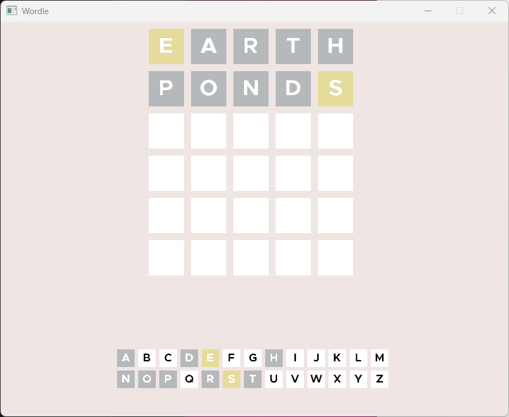
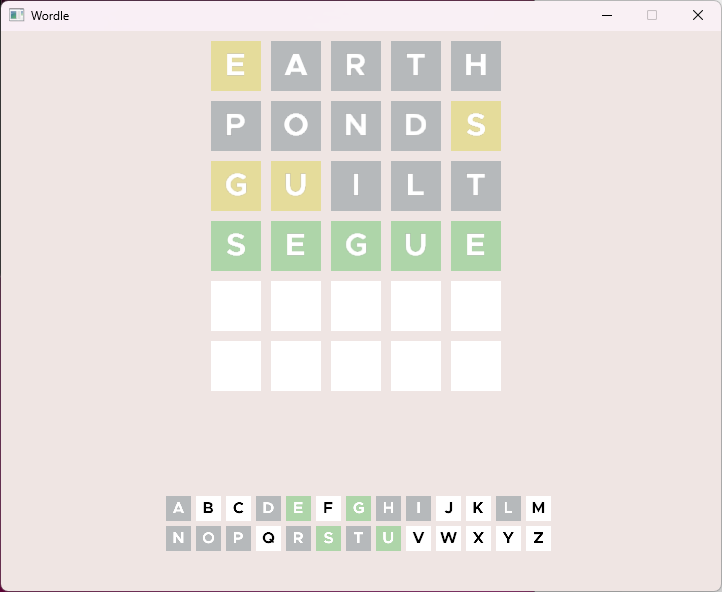

# 🎯 Wordle Clone in Java

A Java implementation of the popular Wordle game with a **client-server architecture**.  

---

## ✨ Features

- **🖥 Client & Server**: Multiple users can connect to the server and play simultaneously.  
- **🎮 Gameplay**: Type letters using your keyboard, **Backspace** to delete, and **Enter** to submit your guesses.  
- **📊 Stats View**: Press **TAB** to switch between the game view and your personal statistics.  

---

## 🖼 Screenshots

### Game Mode

  

  

### Stats View

  

---

## 🚀 How to Run

1. Go to the [**Releases**](https://github.com/Serverautism/wordle/releases) page and download the **client** or **server** release depending on what you want to run.  
2. Extract the downloaded ZIP file.  
3. Navigate to the folder:  
   - For the **client**, go to the `client` folder.  
   - For the **server**, go to the `server` folder.  
4. Run the application by double-clicking the **`run.bat`** file.  

> 💡 **Tip:** Make sure you have Java installed on your system.  

---

## 🛠 Controls

- **Typing**: Letter keys on your keyboard  
- **Backspace**: Delete a letter  
- **Enter**: Submit your guess  
- **TAB**: Switch between game and stats view  

---

## 📄 License

This project is open source. Feel free to contribute via pull requests or fork it.  
